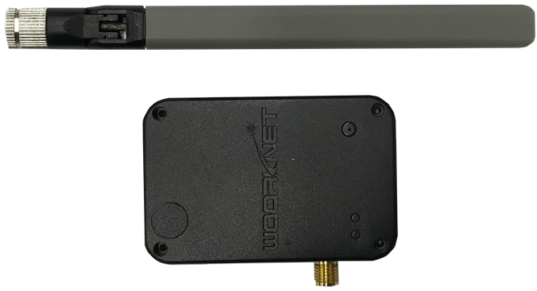
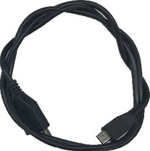

# Cat.M1 외장형 모뎀 WD-N400S의 GPS 가이드

## 목차

-   [시작하기 전에](#Prerequisites)
-   [소개](#Step-1-Overview)
-   [AT 명령어](#Step-2-ATCommand)
-   [동작 구조 예제](#Step-3-SampleCode)

<a name="Prerequisites"></a>

### Development Environment
* **시리얼 터미널 프로그램** ([Hercules](https://www.hw-group.com/software/hercules-setup-utility), [Token2Shell](https://choung.net/token2shell), [PuTTY](https://www.putty.org), [TeraTerm](https://ttssh2.osdn.jp) 등)

### Hardware Requirement

* [**외장형 Cat.M1 모뎀(WD N400S)**](http://wiznetshop.co.kr/product/detail.html?product_no=786)



* [**외장형Cat.M1(WD N400S) Interface B/D **](http://wiznetshop.co.kr/product/detail.html?product_no=787)

  


* [**외장형 Cat.M1 확장 Cable **](http://wiznetshop.co.kr/product/detail.html?product_no=928)

  
  
* [**Micro USB Cable **](http://wiznetshop.co.kr/product/detail.html?product_no=791)

  

* [**외장형 Cat.M1 GPS Antenna **](http://wiznetshop.co.kr/product/detail.html?product_no=930&cate_no=45&display_group=1)


<a name="Step-1-Overview"></a>

## 소개
본 문서에서는 Cat.M1 단말인 우리넷 외장형 모뎀의 GPS 데이터 수신 방법에 대한 가이드를 제공합니다.

WD-N400S의 경우, GPS(Global Positioning System)를 지원하고 있습니다. GPS는 범지구 위성항법 시스템(GNSS, Global Navigation Satellite System)의 한 종류로, 대중적으로 활용되는 글로벌 위성 위치 확인 시스템입니다. 

WD-N400S의 GPS기능을 활용하면, 아이나, 반려동물, 귀중품의 위치를 실시간으로 파악하는 위치 트래커(GPS tracking unit) 등의 위치기반 서비스를 손쉽게 구현할 수 있습니다. Cat.M1 기반의 위치 트래커는 기존의 블루투스 스마트 태그(Bluetooth Smart Tags)와 달리, WD-N400S 자체적으로 파악한 GPS 정보를 LTE망을 이용하여 사용자에게 전달함으로써 보다 빠르고 정확한 위치 파악이 가능한 것이 큰 장점입니다. 

외장형 모뎀은 UART 인터페이스를 통해 활용하는 AT 명령어로 제어하는 것이 일반적입니다. GPS 정보의 획득 기능도 AT 명령어를 이용하여 활성화 할 수 있습니다. 

 <a name="Step-2-ATCommand"></a>

## AT 명령어

### 1.  S/W Version 확인

S/W Version S430XX.015(2019년 12월 1일 빌드 버전) 이후의 경우 GPS 출력 인터페이스 설정을 해주어야만 GPS 기능이 활성화 됩니다. 
S/W Version S430XX.015 전의 경우, 별도의 GPS 출력 인터페이스 설정이 불가능하며, "1. GPS 기능 활성화" AT Command를 사용하시면 됩니다. 

**AT Command:** AT$$SWVER

**Syntax:**

| Type | Syntax | Response | Example |
|:--------|:--------|:--------|:--------|
| Write | AT$$SWVER | $$SWVER:<S/W Version>,<Build date,time> | AT$$SWVER<br>$$SWVER: S430XX.020.01, Mar 24 2021 10:20:01<br>OK |

#### 1-1. GPS 기능 출력 인터페이스 설정

S/W Version S430XX.015(2019년 12월 1일 빌드버전) 이후의 경우에만 해당됩니다. 
S/W Version S430XX.014 버전까지는 2. GPS기능 활성화 부분으로 진행하면 됩니다. 

**AT Command:** AT$$GPSCONF

| Type | Syntax | Response | Example |
|:--------|:--------|:--------|:--------|
| Write | AT$$GPSCONF=<value 1>,<value 2>,<value 3>,<value 4>,<value 5>,<value 6>,<value 7>,<value 8> | $$GPSCONF:<value 1>,<value 2>,<value 3>,<value 4>,<value 5>,<value 6>,<value 7>,<value 8><br><br>OK | AT$$GPSCONF=1,0,1000,252,1,0,1,1<br>$$GPSCONF:1,0,1000,252,1,0,1,1<br><br>OK |

**Defined Values:**

| Parameter | Type | Description |
|:--------|:--------|:--------|
| <value 1> | HEX | 0x00: None<br>0x01: UART1(ATCommand)<br>0x02: UART3<br>0x04: USB Modem(AT Command)<br>0x08: UNIX Domain Socket(UDS)-UDP : /tmp/gnss_sock<br>0x10: UART5 |
| <value 2> | Integear | 측위 횟수<br>범위: 0~0xFFFFFFFF<br>0일 경우 GPS 중단 Command 입력 전까지 계속 GPS 데이터를 출력 합니다. |
| <value 3> | Integear | 측위 주기<br>범위: 1000 ~ 5000 ms |
| <value 4> | Integear | 측위 데이터 구성<br>위도, 경도, 고도, 속도, Heading, H DOP 중 출력할 측위 관련 데이터를 선택 합니다. <br> [7th bit]: 위도, [6th bit]: 경도, [5th bit]: 고도, [4th bit]: 속도, [3rd bit]: Heading, [2nd bit]: H DOP, [1st bit]: resv 1, [0 bit]: resv 2 <br> <br>Ex 1) 위도, 경도만 표실할 경우: 11000000 > 0xC0 > 192<br>Ex 2) 모든 정보 표시: 11111100 > 0xFC > 252 |
| <value 5> | Integear | 망 정보<br>범위: 0~1 |
| <value 6> | Integear | 위/경도 소수점 자리수<br>범위: 0~6|
| <value 7> | Integear | GPS 구동 시, SUPL 가능 여부를 설정 합니다.<br>범위: 0~1 |
| <value 8> | Integear | 표시 시간 설정<br>0: UTC<br>1: 서울|


### 2. GPS 기능 활성화

GPS 기능을 활성화 합니다. 

**AT Command:** AT$$GPS

| Type | Syntax | Response | Example |
|:--------|:--------|:--------|:--------|
| Write | AT$$GPS | OK<br>"GPS정보" | AT$$GPS<br>OK<br>$$GPS,,,,,,,,V,2,255,255,-48,0,0-0,0-0,0-0,0-0<br>$$GPS,,,,,,,,V,2,255,255,-49,16,10,-44,194-42,193-42,12-42|

### 3. GPS 기능 비활성화

GPS 기능을 활성화 합니다. 

**AT Command:** AT$$GPSSTOP

| Type | Syntax | Response | Example |
|:--------|:--------|:--------|:--------|
| Write | AT$$GPSSTOP | OK | AT$$GPSSTOP<br>OK |

<a name="Step-3-SampleCode"></a>

## GPS TEST 

### 1. 하드웨어 연결

- 모뎀을 PC와 Serial로 연결한 후 COM Port Number를 확인합니다.


### 2. 동작 구조 예제


```
// Serial 통신 확인
AT
OK

// S/W Version 확인 (2019년 12월 1일 이후 버전인지 확인)
AT$$SWVER
$$SWVER: S430XX.020.01, Mar 24 2021 10:20:01

OK

// GPS 기능 출력 인터페이스 설정
AT$$GPSCONF=1,0,1000,252,1,6,0,0
$$GPSCONF:1,0,1000,252,1,6,0,0

OK

// GPS 기능 활성화
AT$$GPS
OK
$$GPS,,,,,,,,V,2,255,255,-28,0,0-0,0-0,0-0,0-0
$$GPS,,,,,,,,V,2,255,255,-28,0,0-0,0-0,0-0,0-0
$$GPS,,,,,,,,V,2,255,255,-49,16,10,-44,194-42,193-42,12-42
$$GPS,,,,,,,,V,2,255,255,-49,16,10,-44,194-42,193-42,12-42
$$GPS,,,,,,,,V,2,255,255,-49,16,10,-44,194-42,193-42,12-42
...

//GPS 기능 비활성화
AT$$GPSSTOP
OK
```

