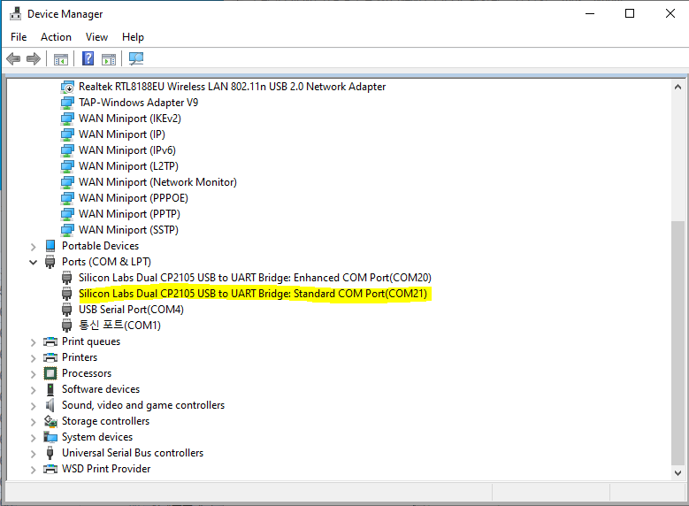
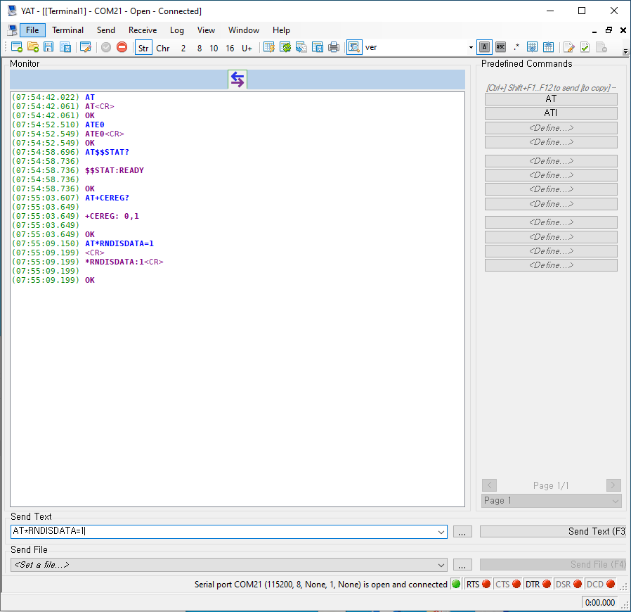
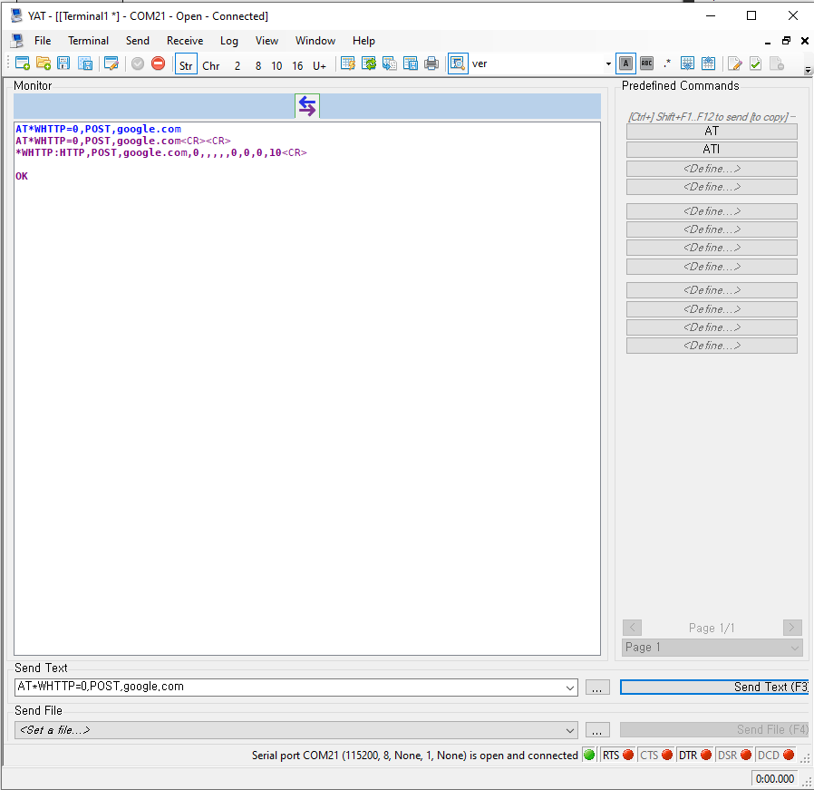
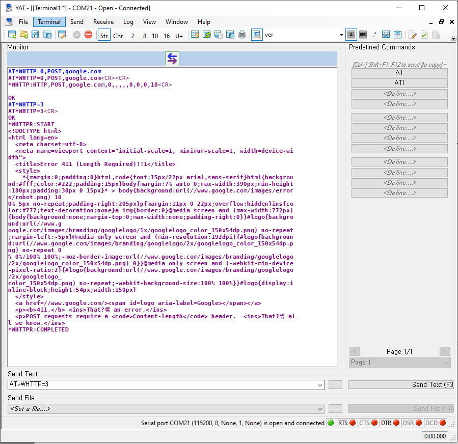

# Cat.M1 외장형 모뎀 WD-N400S의 TCP/IP 데이터 통신 가이드

## 목차

-   [소개](#Step-1-Overview)
-   [AT 명령어](#Step-2-ATCommand)
-   [HTTP Client Test](#Step-3-Test)

<a name="Prerequisites"></a>


### Development Environment
* **시리얼 터미널 프로그램** ([Token2Shell](https://choung.net/token2shell), [PuTTY](https://www.putty.org), [TeraTerm](https://ttssh2.osdn.jp) 등)

- **TCP Server 프로그램** ([Hercules](https://www.hw-group.com/software/hercules-setup-utility) 등)


### Hardware Requirement

* [**외장형 Cat.M1 모뎀(WD N400S)**](http://wiznetshop.co.kr/product/detail.html?product_no=786)


* [**외장형Cat.M1(WD N400S) Interface B/D **](http://wiznetshop.co.kr/product/detail.html?product_no=787)

  


* [**외장형 Cat.M1 확장 Cable **](http://wiznetshop.co.kr/product/detail.html?product_no=928)

  
  
* [**Micro USB Cable **](http://wiznetshop.co.kr/product/detail.html?product_no=791)

  

<a name="Step-1-Overview"></a>

## 소개
본 문서에서는 Cat.M1 단말인 우리넷 외장형 모뎀의 HTTP 데이터 송수신 방법에 대한 가이드를 제공합니다.

외장형 모뎀은 UART 인터페이스를 통해 활용하는 AT 명령어로 제어하는 것이 일반적입니다. Cat.M1 모듈 제조사에 따라 AT 명령어의 차이는 있지만, 일반적인 HTTP client의 통신 과정은 다음과 같은 순서로 구현합니다.

1. 네트워크 인터페이스 활성화
2. HTTP 설정 - 목적지 URL, 옵션
3. HTTP Request 전송
4. HTTP Response 확인
5. 네트워크 인터페이스 비활성화

추가적으로, TCP 가이드 문서에는 다른 응용 가이드 문서에는 포함되어 있지 않은 Cat.M1 단말의 상태 확인 및 PDP context 관련 명령어에 대한 내용이 함께 포함되어 있습니다. 해당 명령어는 응용 구현 시 필수적으로 활용되어야 하므로, 함께 확인하시기 바랍니다.
* Echo 모드 설정: `ATE`
* USIM 상태 확인: `AT$$STAT?`
* 망 등록 및 상태 점검: `AT+CEREG`
* PDP Context 활성화 및 비활성화: `AT*RNDISDATA`
<a name="Step-2-ATCommand"></a>
## AT 명령어

### 1. 모듈 초기 설정

Cat M1 모듈의 에코 모드 설명, USIM 상태 확인, 네트워크 접속 확인, PDP Context 활성화 등의 일반적인 내용은 TCP 가이드를 참고하시기 바랍니다.

### 2. HTTP 설정
HTTP/HTTPS설정 및 확인

**AT Command:** AT*WHTTP

**Syntax:**

| Type | Syntax | Response | Example
|:--------|:--------|:--------|:--------|
| Write | AT*WHTTP=\<CODE>,\<METHOD>,\<URL>[,\<PORT>[,\<ID>[,\<PW>[,\<DATA>[,\<HEAD>[,\<HEADONLY>[,\<HEADBODY>[,\<NOCERT>[,\<TIMEOUT>]]]]]]]]] | *WHTTP:\<CODE>,\<METHOD>,\<URL>,\<PORT>,\<ID>,\<PW>,\<DATA>,\<HEAD>,\<HEADONLY>,\<HEADBODY>,\<NOCERT>,\<TIMEOUT><br><br>OK | AT*WHTTP=0,POST,google.com<br>*WHTTP:HTTP,POST,google.com,0,,,,,0,0,0,10,TCP<br><br>OK |

**Defined values:**

| Parameter | Type    | Description                                       |
| :-------- | :------ | :------------------------------------------------ |
| \<CODE> | integer | Code Type<br>0: HTTP<br>1: HTTPS<br>2: OPTION<Br> 3: START<br> 4: STOP |
| \<METHOD>  | string  | GET, POST, PUT, DELETE |
| \<URL>  | string | HTTP Server의 URL                  |
| \<PORT>  | integer | HTTP Server의 Port Number<br> 값이 없을 경우 Default Value    |
| \<ID>  | string | ID<br> 값이 없을 경우 ID 없음 |
| \<PW>  | string | Password<br> 값이 없을 경우 Password 없음 |
| \<DATA>  | string | POST Data   <br> 값이 없을 경우 Data 없음   |
|\<HEAD>  | string  | Header 입력(MAX 5개, 하나당 최대 64byte)<br> 값이 없을 경우 Default Header |
| \<HEADONLY>  | integer | 0: Header, Content 모두 표시<br>1 : Header만 표시<br> 값이 없을 경우 Body만 표시 |
| \<HEADBODY>  | integer | 0: Body만 표시<br>1 : Header, Body 모두 표시 <br> 값이 없을 경우 Body만 표시|
| \<NOCERT>  | integer | 0 : SSL Cerificate검증<br>1 : SSL Cerificat 검증안함<br> 값이 없을 경우 검증함 |
| \<TIMEOUT> | integer | Connect Timeout 설정 <br> 값이 없거나 0일 경우 10초 |

### 3. HTTP 옵션 설정
HTTP/HTTPS옵션 설정 및 확인

**AT Command:** AT*WHTTP

**Syntax:**

| Type | Syntax | Response | Example
|:--------|:--------|:--------|:--------|
| Write | AT*WHTTP=2,\<value1>,\<value2> | *WHTTP:\<value1>,\<value2><br><br>OK | AT*WHTTP=2,HEAD,Content-Type: application/json<br>*WHTTP: HEAD,Content-Type: application/json<br><br>OK |

**Defined values:**

| Parameter | Type    | Description                                       |
| :-------- | :------ | :------------------------------------------------ |
| \<value1> | string | METHOD, URL, PORT, ID, PW, DATA, HEAD, HEADONLY, HEADBODY, NOCERT, TIMEOUT |
| \<value2>  | string  | \<value1>-METHOD: GET,POST,PUT,DELETE<br>\<value1>-URL: HTTP Server의 URL<br>\<value1>-PORT: HTTP Server의 Port Number<br>\<value1>-ID: ID<br>\<value1>-PW: Password<br>\<value1>-DATA: HTTP Post Data<br>\<value1>-HEAD: Header 입력(MAX 5개, 하나당 최대 64byte)<br>\<value1>-HEADONLY: 0: Header, Content 모두 표시, 1 : Header만 표시<br>\<value1>-HEADBODY: 0: Body만 표시, 1 : Header, Body 모두 표시<br>\<value1>-NOCERT: 0 : SSL Cerificate검증, 1 : SSL Cerificat 검증 안함<br> \<value1>-TIMEOUT: Connect Timeout 설정<br> |


### 4. HTTP 시작
HTTP/HTTPS 시작 및 정지
AT\*WHTTP=3 명령으로 START 되며, 완료되기전에 AT\*WHTTP=4 명령을 전송할 경우 중단된다.

**AT Command:** AT*WHTTP

**Syntax:**

| Type | Syntax | Response | Example
|:--------|:--------|:--------|:--------|
| Write | AT*WHTTP=3 |*WHTTPR:START<br>….<br>*WHTTPR:COMPLETED | AT*WHTTP=3<br>*WHTTPR:START<br>test2<br>*WHTTPR:COMPLETED |
| Write | AT*WHTTP=4 |[*WHTTPR:EXEC_FAILED]<br>OK | AT*WHTTP=4<br>*WHTTPR:START<br>Terminated<br>*WHTTPR:EXEC_FAILED<br>OK |


<a name="Step-3-Test"></a>

## TCP Client Test 

### 1. 하드웨어 연결

- 모뎀을 PC와 Serial로 연결한 후 COM Port Number를 확인합니다.





### 2. 모듈 상태 확인

- 확인한 COM Port Nubmer로 Serial Terminal 프로그램을 실행하여 Open합니다. TCP Socket을 생성하기전에 아래의 명령어를 수행합니다.


```
// Serial 통신 확인
AT
OK

// AT 명령어 echo 비활성화
ATE0
OK

// USIM 상태 확인 (READY : 정상)
AT$$STAT?
$$STAT:READY

OK

// 망 접속 확인
AT+CEREG?
+CEREG: 0,1

OK

// PDP context 활성화
AT*RNDISDATA=1
*RNDISDATA:1

OK
```



### 3. HTTP 설정 및 시작

- HTTP를 설정합니다. Server주소는 google.com, POST method를 전송합니다.




- HTTP START를 설정하여 POST method를 전송하고 Response를 수신합니다.




