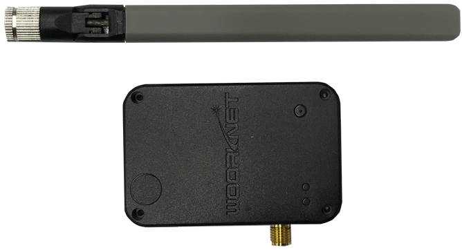
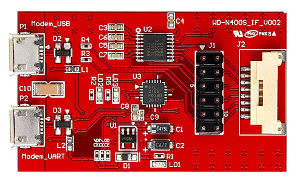
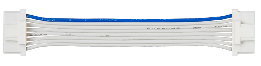
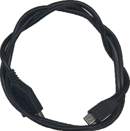

# Cat.M1 외장형 모뎀 WD-N400S의 MQTT 데이터 통신 가이드

## 목차

-   [시작하기 전에](#Prerequisites)
-   [소개](#Step-1-Overview)
-   [AT 명령어](#Step-2-ATCommand)
-   [동작 구조 예제](#Step-3-SampleCode)
-   [예제 코드 빌드 및 실행](#Step-4-Build-and-Run)

### Development Environment
* **시리얼 터미널 프로그램** ([Hercules](https://www.hw-group.com/software/hercules-setup-utility), [Token2Shell](https://choung.net/token2shell), [PuTTY](https://www.putty.org), [TeraTerm](https://ttssh2.osdn.jp)  등)

### Hardware Requirement

* [**외장형 Cat.M1 모뎀(WD N400S)**](http://wiznetshop.co.kr/product/detail.html?product_no=786)

* [**외장형Cat.M1(WD N400S) Interface B/D **](http://wiznetshop.co.kr/product/detail.html?product_no=787)

  

* [**외장형 Cat.M1 확장 Cable **](http://wiznetshop.co.kr/product/detail.html?product_no=928)

  
  
* [**Micro USB Cable **](http://wiznetshop.co.kr/product/detail.html?product_no=791)

  

  []: 

## 소개
본 문서에서는 Cat.M1 단말인 WD-N400S(우리넷 외장형 모뎀)의 MQTT 데이터 송수신 방법에 대한 가이드를 제공합니다. 

WD-N400S(우리넷 외장형 모뎀)은 UART 인터페이스를 통해 AT 명령어로 제어하는 것이 일반적입니다. Cat.M1 모듈 제조사에 따라 AT 명령어의 차이는 있지만, 일반적인 MQTT Client의 통신 과정은 다음과 같은 순서로 구현합니다. 

1. MQTT 접속
2. MQTT 데이터 전송(Publish)
3. MQTT 데이터 구독(Subscribe)
4. MQTT 접속 해제

이번 MQTT 테스트에서는 MQTT Broker로 HiveMQ를 사용하였습니다. HiveMQ의 Public MQTT Broker와 Websocket Client를 통해 WD-N400S의 Pub/Sub 데이터 송수신을 비교, 확인하실 수 있습니다. 

### [HiveMQ](https://www.hivemq.com)
* Host: broker.hivemq.com
* TCP Port: 1883 

## AT 명령어

### 1.  S/W Version 확인

S/W Version S430XX.020(21년 3월 24일 빌드 버전) 이후의 경우 MQTT 명령어를 지원합니다. 이전 S/W Version의 경우, S/W 업데이트를 진행하시거나, TCP/IP Layer에서 MQTT 어플리케이션을 구현하셔야 합니다. 

본 가이드는 S/W Version S430XX.020을 기반으로 작성되었습니다. 

**S/W Version S430XX.020 고려사항**

*  MQTT V3.1.1, V3.1 지원하며, MQTT V5는 지원하지 않습니다. 
*  TLS 1.3은 지원하지 않습니다. 
*  Will topic, Qos는 지원하지 않습니다. 

**AT Command:** AT$$SWVER

**Syntax:**

| Type | Syntax | Response | Example |
|:--------|:--------|:--------|:--------|
| Write | AT$$SWVER | $$SWVER:<S/W Version>,<Build date,time> | AT$$SWVER $$SWVER: S430XX.020.01, Mar 24 2021 10:20:01 OK |

### 2. MQTT 접속

MQTT Broker 서버에 접속하기 위한 MQTT 환경 설정(Configuration)을 진행합니다.  

#### 2-1. MQTT HOST URL 설정 <필수>
**AT Command:** AT\*WMQTCFG=endpoint,"HOST URL"

| Type | Syntax | Response | Example |
|:--------|:--------|:--------|:--------|
| Write | AT\*WMQTCFG=endpoint,"HOST URL" | \*WMQTCXFG:endpoint,"HOST URL"  OK | AT\*WMQTCFG=endpoint,broker.mqttdashboard.com \*WMQTCFG:endpoint,broker.mqttdashboard.com  OK |

#### 2-2. MQTT Device ID 설정 <필수>
**AT Command:** AT\*WMQTCFG=clientname,"Device ID"

| Type | Syntax | Response | Example |
|:--------|:--------|:--------|:--------|
| Write | AT\*WMQTCFG=clientname,"Device ID" | \*WMQTCXFG:clientname,"Device ID"  OK | AT\*WMQTCFG=clientname,op_device_1 \*WMQTCFG:clientname,op_device_1  OK |

**Device ID**: 단말을 구분하기 위한 임의의 Device ID()

#### 2-3. MQTT Port 설정 <옵션>
**AT Command:** AT\*WMQTCFG=port,"Port"

| Type | Syntax | Response | Example |
|:--------|:--------|:--------|:--------|
| Write | AT\*WMQTCFG=port,"Port" | \*WMQTCXFG:port,"Port"  OK | AT\*WMQTCFG=port,1883 \*WMQTCFG:port,1883  OK |

**Port**: MQTT: 1883  / MQTTS: 8883

#### 2-4. MQTT Keep Alive 설정 <옵션>
**AT Command:** AT\*WMQTCFG=keepalive,"Keep Alive time"

| Type | Syntax | Response | Example |
|:--------|:--------|:--------|:--------|
| Write | AT\*WMQTCFG=keepalive,"Keep Alive time" | \*WMQTCXFG:keepalive,"Keep Alive time"  OK | AT\*WMQTCFG=keepalive,600 \*WMQTCFG:keepalive,600  OK |

**Keep Alive time**: 1 ~ 7200 초 (1 ~ 1800초 권장)

#### 2-5. MQTT Clean Session 설정 <옵션>
**AT Command:** AT\*WMQTCFG=cleansession,"Clean Session"

| Type | Syntax | Response | Example |
|:--------|:--------|:--------|:--------|
| Write | AT\*WMQTCFG=cleansession,"Clean Session" | \*WMQTCXFG:cleansession,"Clean Session"  OK | AT\*WMQTCFG=cleansession,1 \*WMQTCFG:cleansession,1  OK |

**Clean Session**: 0 - 세션정보 유지,  1-세션정보 삭제

#### 2-6. MQTT Host Username 설정 <옵션>
**AT Command:** AT\*WMQTCFG=username,"Username"

| Type | Syntax | Response | Example |
|:--------|:--------|:--------|:--------|
| Write | AT\*WMQTCFG=username,"Username" | \*WMQTCXFG:username,"Username"  OK | AT\*WMQTCFG=username,openhouse \*WMQTCFG:username,openhouse  OK |

**Username**: Broker Server의 Username  (Broker Server에 Username을 설정한 경우, 필수 설정)

#### 2-7. MQTT Host Password 설정 <옵션>
**AT Command:** AT\*WMQTCFG=password,"Password"

| Type | Syntax | Response | Example |
|:--------|:--------|:--------|:--------|
| Write | AT\*WMQTCFG=password,"Password" | \*WMQTCXFG:password,"Password"  OK | AT\*WMQTCFG=password,test \*WMQTCFG:password,test  OK |

**test**: Broker Server의 Password (Broker Server에 Password를 설정한 경우, 필수 설정)

#### 2-8. MQTT Configuration 조회
**AT Command:** AT\*WMQTCFG?

MQTT Configuration 값이 모두 나오며, 2-1 ~ 2-7 까지 설명된 다른 값들의 경우 MQTTS에서 사용되는 설정 값 입니다. 

#### 2-9. MQTT 접속
**AT Command:** AT\*WMQTCON

| Type | Syntax | Response | Example |
|:--------|:--------|:--------|:--------|
| Write | AT\*WMQTCON |\*WMQTCON:\<stat\> | AT\*WMQTCON \*WMQTCON:1 \*WMQTCON:2 |

**\<stat\>** -1: 접속 실패,  0: 미접속 상태,  1: 접속 진행중,  2: 접속 성공

### 3. MQTT 데이터 전송 (Publish)
**AT Command:** AT\*WMQTPUB

| Type | Syntax | Response | Example |
|:--------|:--------|:--------|:--------|
| Write | AT\*WMQTPUB=\<topic\>,"\<msg\>",[\<qos\>],[\<retain\>] |OK \*WMQTPUB:\<count\> | AT\*WMQTPUB=testtopic/openhouse,"hello openhouse" \*WMQTPUB:1 OK AT\*WMQTPUB=testtopic/openhouse,"hello openhouse" \*WMQTPUB:2 OK |

**\<topic\>**: MQTT Broker Server의 topic
**\<msg>**: Publish 하고자 하는 message (최대 1500 byte)
**\<count\>**: Publish Message 수 (1부터 1씩 증가, **NC**: MQTT 연결 안된 상태)
**\<qos\>**: 범위 0~2

### 4. MQTT 데이터 구독 (Subscribe)

**AT Command:** AT\*WMQTSUB

| Type | Syntax | Response | Example |
|:--------|:--------|:--------|:--------|
| Write | AT\*WMQTSUB=\<topic\>,[\<qos\>]|OK \*WMQTSUB:\<topic\>,[\<qos\>]  **\<ERROR\>** \*WMQTSUB:AE(이미 등록된 Topic) \*WMQTSUB:NC(MQTT 연결안됨)| AT\*WMQTSUB=testtopic/openhouse OK \*WMQTSUB:testtopic/openhouse **Topic에 다른 Publish가 되는 경우** \*WMQTRCV:testtopic/openhouse,"Broker Server Publish TEST"|

**\<topic\>**: MQTT Broker Server의 topic

**MQTT 구독해지**
**AT Command:** AT\*WMQTUNS=\<topic\>

### 5. MQTT 접속 해제
**AT Command:** AT\*WMQTDIS

| Type | Syntax | Response | Example |
|:--------|:--------|:--------|:--------|
| Write | AT\*WMQTDIS |OK\*WMQTDIS:0 | AT\*WMQTDIS OK \*WMQTDIS:0 |

## 동작 구조 예제

위에 설명한 대로, MQTT Broker는 HiveMQ(broker.hivemq.com:1883)를 사용합니다. 
HiveMQ DNS주소, MQTT 포트 번호, Username, Password만 설정 후 기억하면 됩니다. 
HiveMQ MQTT Websocket Client는 아래 링크에서 바로 테스트가 가능합니다. 

> * [HiveMQ Websocket Client](http://www.hivemq.com/demos/websocket-client/)

먼저, HiveMQ MQTT Websocket Client를 HiveMQ Public Broker에 접속하도록 하겠습니다.
이 때, Username과 Password는 "testid"와 "testpassword"로 설정하도록 하겠습니다.
* Host: broker.mqttdashboard.com
* TCP Port: 8000
* Username: "openhouse" 
* Password: "test"

