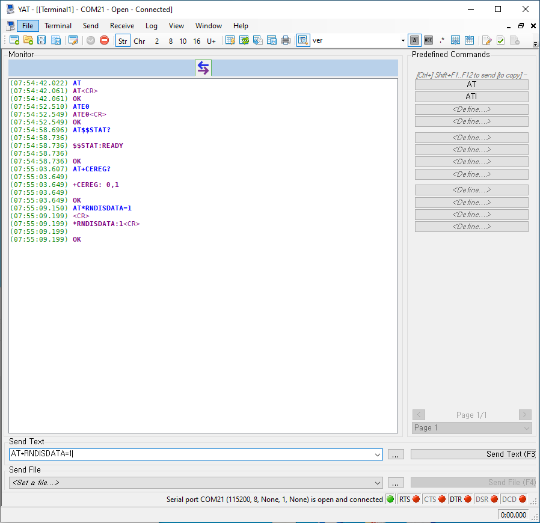
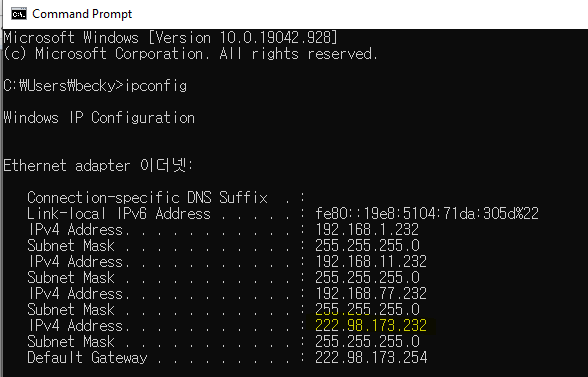
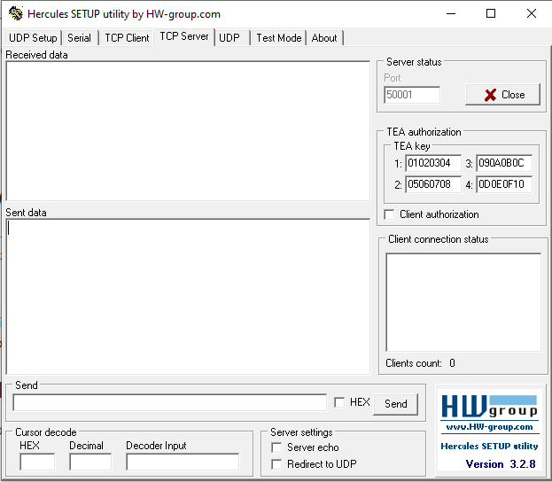
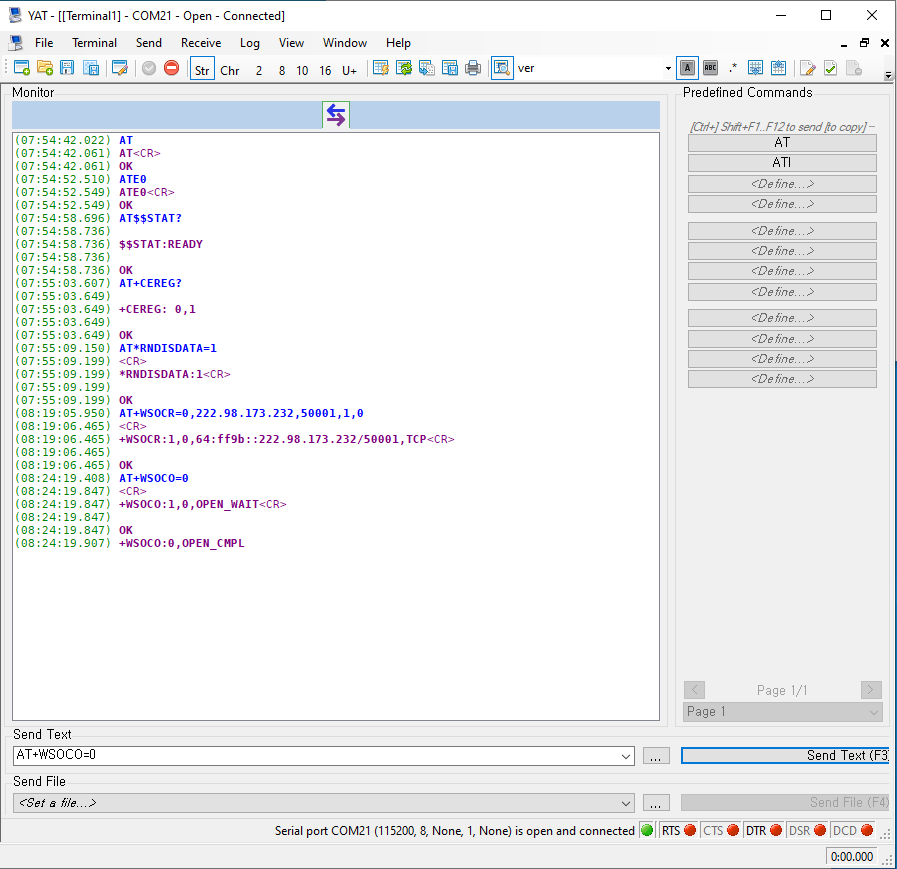
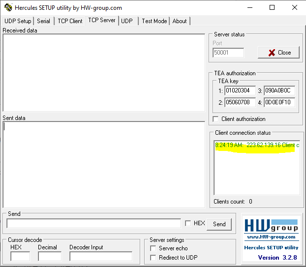
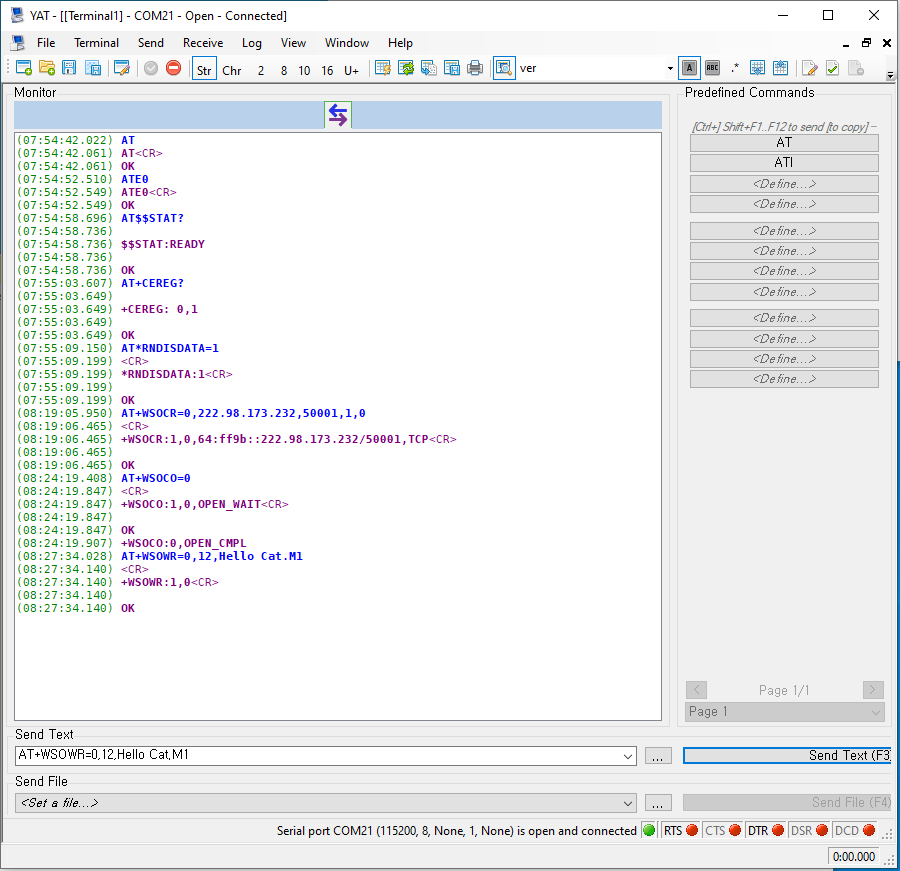
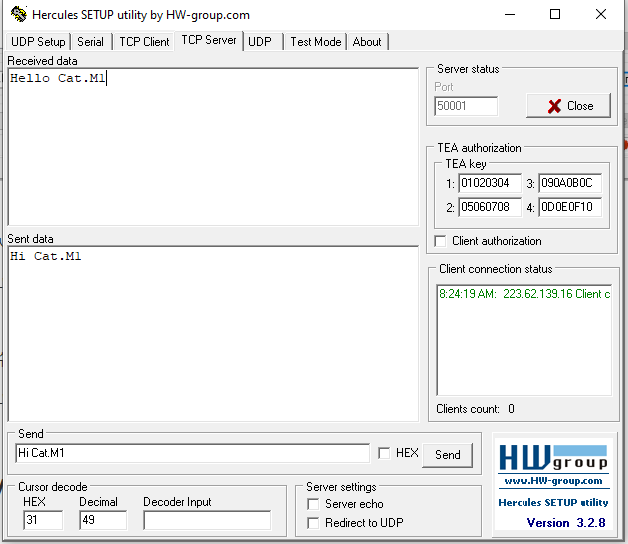
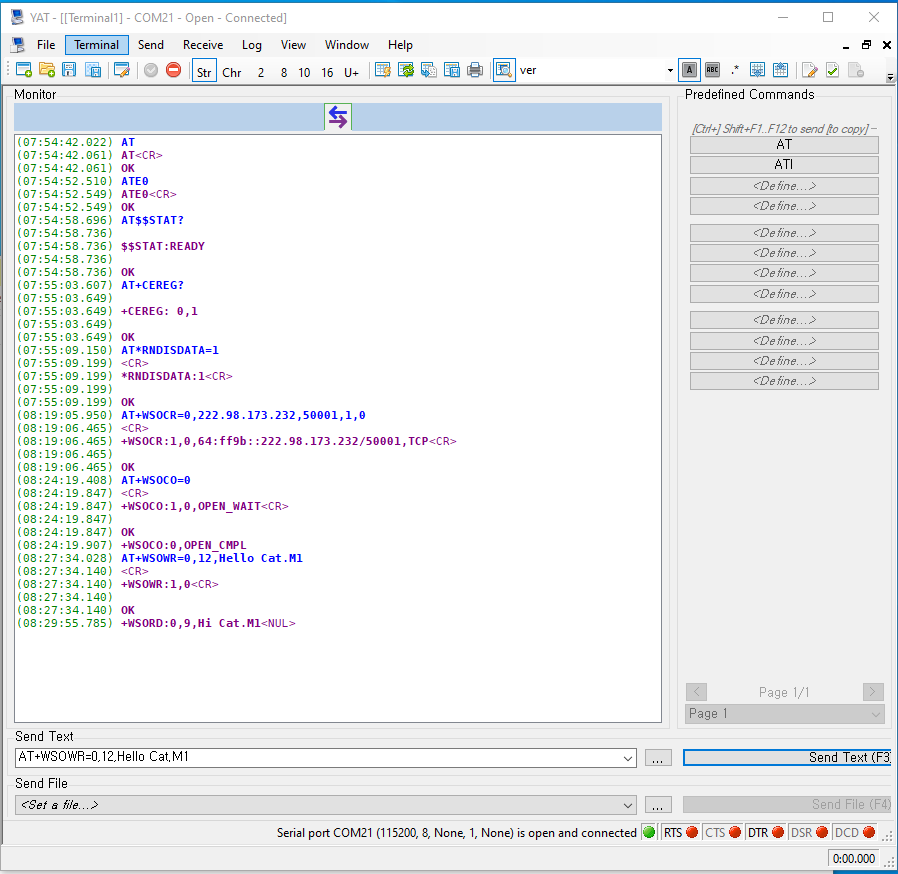
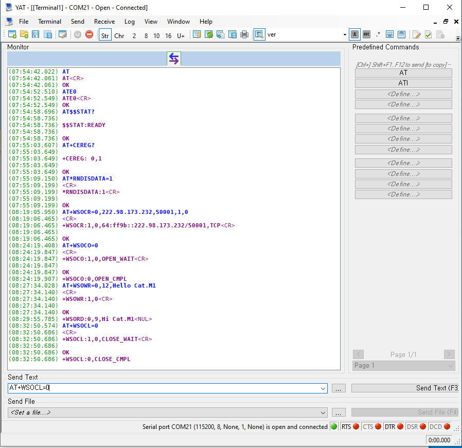

# Cat.M1 외장형 모뎀 WD-N400S의 TCP/IP 데이터 통신 가이드

## 목차

-   [소개](#Step-1-Overview)
-   [AT 명령어](#Step-2-ATCommand)
-   [TCP Client Test](#Step-3-Test)

<a name="Prerequisites"></a>


### Development Environment
* **시리얼 터미널 프로그램** ([Token2Shell](https://choung.net/token2shell), [PuTTY](https://www.putty.org), [TeraTerm](https://ttssh2.osdn.jp) 등)

- **TCP Server 프로그램** ([Hercules](https://www.hw-group.com/software/hercules-setup-utility) 등)


### Hardware Requirement

* [**외장형 Cat.M1 모뎀(WD N400S)**](http://wiznetshop.co.kr/product/detail.html?product_no=786)


* [**외장형Cat.M1(WD N400S) Interface B/D **](http://wiznetshop.co.kr/product/detail.html?product_no=787)

  


* [**외장형 Cat.M1 확장 Cable **](http://wiznetshop.co.kr/product/detail.html?product_no=928)

  
  
* [**Micro USB Cable **](http://wiznetshop.co.kr/product/detail.html?product_no=791)

  

<a name="Step-1-Overview"></a>

## 소개
본 문서에서는 Cat.M1 단말인 우리넷 외장형 모뎀의 TCP 데이터 송수신 방법에 대한 가이드를 제공합니다.

외장형 모뎀은 UART 인터페이스를 통해 활용하는 AT 명령어로 제어하는 것이 일반적입니다. Cat.M1 모듈 제조사에 따라 AT 명령어의 차이는 있지만, 일반적인 TCP client(UDP 포함)의 통신 과정은 다음과 같은 순서로 구현합니다.

1. 네트워크 인터페이스 활성화
2. 소켓 열기 - 목적지 IP 주소 및 포트번호 포함
3. 데이터 전송 - 송신 및 수신
4. 소켓 닫기
5. 네트워크 인터페이스 비활성화

추가적으로, TCP 가이드 문서에는 다른 응용 가이드 문서에는 포함되어 있지 않은 Cat.M1 단말의 상태 확인 및 PDP context 관련 명령어에 대한 내용이 함께 포함되어 있습니다. 해당 명령어는 응용 구현 시 필수적으로 활용되어야 하므로, 함께 확인하시기 바랍니다.
* Echo 모드 설정: `ATE`
* USIM 상태 확인: `AT$$STAT?`
* 망 등록 및 상태 점검: `AT+CEREG`
* PDP Context 활성화 및 비활성화: `AT*RNDISDATA`
<a name="Step-2-ATCommand"></a>
## AT 명령어

### 1. Echo 모드 설정

ATE0로 설정되면 입력된 명령어 Echo back이 비활성화 됩니다.
MCU board로 Cat.M1 모듈을 제어하는 경우 해당 명령어를 사용합니다.

**AT Command:** ATE

**Syntax:**

| Type | Syntax | Response | Example
|:--------|:--------|:--------|:--------|
| Write | ATE(value1) | OK | ATE0<br>OK |

**Defined values:**

| Parameter | Type    | Description                           |
| :-------- | :------ | :------------------------------------ |
| (value1)  | integer | 0 : Echo mode OFF<br>1 : Echo mode ON |

### 2. USIM 상태 확인
이 명령어는 USIM의 Password를 입력하거나 password 입력이 필요 없는 경우 USIM의 정상 운용이 가능한 상황인지 확인합니다. 본 가이드에서는 password가 없는 상황에서 USIM 상태를 확인하기 위해 사용합니다.
> **READY** 응답이 출력되면 정상입니다.

**AT Command:** AT$$STAT?

**Syntax:**

| Type | Syntax | Response | Example
|:--------|:--------|:--------|:--------|
| Read | AT$$STAT? | $$STAT:(value1) | AT$$STAT?<br>$$STAT:READY<br><br>OK |

**Defined values:**

| Parameter | Type   | Description                                                  |
| :-------- | :----- | :----------------------------------------------------------- |
| (value1)  | string | INSERT : USIM card inserted<br>OPEN : MSISDN NULL<br>READY : 정상적으로 Card Initialization 마친 상태<br>MNCCARD : 다른 사업자 USIM<br>MCCRAD : 해외 사업자 USIM<br>TESTCARD : 장비 테스트 USIM<br>ONCHIP : onChip SIM mode<br>PIN : SIM PIN, SIM PUK 등 남은 시도 횟수<br>NET PIN : PLMN ID 이외의 값을 가진 카드<br>SIM PERM BLOCK : PUK 모두 실패. 카드 교체 필요<br>SIM PIN VERIFIED : PIN code 입력 성공<br>SIM PERSO OK : Personalization unlock 성공<br>FAILURE, REMOVED : USIM removed<br>FAILURE,NO_CARD : USIM 삽입 안됨<br>AILURE,ERROR : USIM인식 Error |

### 3. 망 등록 및 상태 점검

망 서비스 상태 확인을 위해 사용되는 명령어 입니다. 디바이스 구현 시, 망 연결 유지를 위해 주기적으로 체크하는 것을 권장합니다.

**AT Command:** AT+CEREG?

**Syntax:**


| Type | Syntax | Response | Example
|:--------|:--------|:--------|:--------|
| Read | AT+CEREG? | +CEREG: (value1),(value2)<br><br>OK | AT+CEREG?<br>+CEREG: 0,1<br><br>OK |

**Defined values:**

| Parameter |  Type   | Description                                                  |
| :-------- | :-----: | :----------------------------------------------------------- |
| (value1)  | integer | 0 : Disable network registration unsolicited result code<br>1 : Enable network registration unsolicited result code<br>2 : Enable network registration and location information unsolicited result code<br>4 : For a UE that wants to apply PSM, enable network registration and location information unsolicited result code |
| (value2)  | integer | 0 : Not registered. MT is not currently searching an operator to register to.<br>1 : Registered, home network<br>2 : Not registered, but MT is currently trying to attach or searching an operator to register to.<br>3 : Registration denied<br>4 : Unknown<br>5 : Registered, roaming |

### 4. PDP Context 활성화 및 비활성화
> PDP(Packet Data Protocol)란 단말과 외부 패킷 데이터 네트워크 사이의 데이터 송수신을 위한 연결을 제공하기 위해 사용하는 네트워크 프로토콜을 뜻하며, PDP Context는 이러한 연결 과정에서 사용되는 정보의 집합을 의미합니다.

**AT Command:** AT*RNDISDATA

**Syntax:**

| Type | Syntax | Response | Example
|:--------|:--------|:--------|:--------|
| Write | AT*RNDISDATA=(value1) | *RNDISDATA=(value2)<br><br>OK | AT\*RNDISDATA=1<br>*RNDISDATA:1<br><br>OK |

**Defined values:**

| Parameter | Type    | Description                                                  |
| :-------- | :------ | :----------------------------------------------------------- |
| (value1)  | integer | 0 : RNDIS Device 미사용(전화 접속 연결 사용)<br>1 : RNDIS Device 사용(전화 접속 연결 사용 불가) |

| Parameter | Type    | Description                                                  |
| :-------- | :------ | :----------------------------------------------------------- |
| (value2)  | integer | 0 : RNDIS Device 미사용(전화 접속 연결 사용)<br>1 : RNDIS Device 사용(전화 접속 연결 사용 불가) |

### 5. 소켓 생성
소켓 서비스를 생성하는 명령어 입니다.

**AT Command:** AT+WSOCR

**Syntax:**

| Type | Syntax | Response | Example
|:--------|:--------|:--------|:--------|
| Write | AT+WSOCR=(value1),(value2),(value3),(value4),(value5) | +WSOCR:(value6),(value7),(value8),(value9)<br><br>OK | AT+WSOCR=0,222.98.173.214,8080,1,0<br>+WSOCR:1,0,64:ff9b::222.98.173.214/8080,TCP<br><br>OK |

**Defined values:**

| Parameter | Type    | Description                                       |
| :-------- | :------ | :------------------------------------------------ |
| (value1)  | integer | Socket ID                                         |
| (value2)  | string  | IP Address or URL                                 |
| (value3)  | integer | Port                                              |
| (value4)  | integer | Protocol<br>1 : TCP<br>2 : UDP                    |
| (value5)  | integer | Packet Type<br>0 : ASCII<br>1 : HEX<br>2 : Binary |

| Parameter | Type    | Description                    |
| :-------- | :------ | :----------------------------- |
| (value6)  | integer | Result<br>0 : 실패<br>1 : 성공 |
| (value7)  | integer | Socket ID                      |
| (value8)  | string  | IP Adress/Port                 |
| (value9)  | integer | Protocol<br>1 : TCP<br>2 : UDP |

### 6. 소켓 연결
지정된 소켓 서비스를 연결하는 명령어 입니다.

**AT Command:** AT+WSOCO

**Syntax:**

| Type | Syntax | Response | Example
|:--------|:--------|:--------|:--------|
| Write | AT+WSOCO=(value1)| +WSOCO:(value2),(value3),OPEN_WAIT<br><br>OK<br>+WSOCO:(value4),OPEN_CMPL | AT+WSOCO=0<br>+WSOCO:1,0,OPEN_WAIT<br><br>OK<br>+WSOCO:0,OPEN_CMPL |

**Defined values:**

| Parameter | Type    | Description |
| :-------- | :------ | :---------- |
| (value1)  | integer | Socket ID   |

| Parameter | Type    | Description                    |
| :-------- | :------ | :----------------------------- |
| (value2)  | integer | Result<br>0 : 실패<br>1 : 성공 |
| (value3)  | integer | Socket ID                      |
| (value4)  | integer | Socket ID                      |

### 7. 소켓 데이터 전송

지정된 소켓으로 데이터를 전송하는 명령어 입니다.

**AT Command:** AT+WSOWR

**Syntax:**

| Type | Syntax | Response | Example
|:--------|:--------|:--------|:--------|
| Write | AT+WSOWR=(value1),(value2),(value3) | +WSOWR:(value4),(value5)<br><br>OK | AT+WSOWR=0,12,Hello Cat.M1<br>+WSOWR:1,0<br><br>OK |

**Defined values:**

| Parameter | Type    | Description |
| :-------- | :------ | :---------- |
| (value1)  | integer | Socket ID   |
| (value2)  | integer | Data Length |
| (value3)  | string  | Data        |

| Parameter | Type    | Description                    |
| :-------- | :------ | :----------------------------- |
| (value4)  | integer | Result<br>0 : 실패<br>1 : 성공 |
| (value5)  | integer | Socket ID                      |

### 8. 소켓 데이터 수신
지정된 소켓으로부터 데이터를 수신하는 명령어 입니다.

**AT Command:** +WSORD

**Syntax:**

| Type | Syntax | Response | Example
|:--------|:--------|:--------|:--------|
| Read | | +WSORD=(value1),(value2),(value3) | +WSORD:0,9,Hi Cat.M1 |

**Defined values:**

| Parameter | Type    | Description |
| :-------- | :------ | :---------- |
| (value1)  | integer | Socket ID   |
| (value2)  | integer | Data Length |
| (value3)  | string  | Data        |

### 9. 소켓 종료
지정된 소켓 서비스를 종료하는 명령어 입니다.

**AT Command:** AT+WSOCL

**Syntax:**

| Type | Syntax | Response | Example
|:--------|:--------|:--------|:--------|
| Write | AT+WSOCL=(value1) | +WSOCL:(value2),(value3),CLOSE_WAIT<br><br>OK<br>+WSOCL:(value4),CLOSE_CMPL | AT+WSOCL=0<br>+WSOCL:1,0,CLOSE_WAIT<br><br>OK<br>+WSOCL:0,CLOSE_CMPL |

**Defined values:**

| Parameter | Type    | Description |
| :-------- | :------ | :---------- |
| (value1)  | integer | Socket ID   |

| Parameter | Type    | Description                    |
| :-------- | :------ | :----------------------------- |
| (value2)  | integer | Result<br>0 : 실패<br>1 : 성공 |
| (value3)  | integer | Socket ID                      |
| (value4)  | integer | Socket ID                      |

<a name="Step-3-Test"></a>

## TCP Client Test 

### 1. 하드웨어 연결

- 모뎀을 PC와 Serial로 연결한 후 COM Port Number를 확인합니다.


### 2. 모듈 상태 확인

- 확인한 COM Port Nubmer로 Serial Terminal 프로그램을 실행하여 Open합니다. TCP Socket을 생성하기전에 아래의 명령어를 수행합니다.


```
// Serial 통신 확인
AT
OK

// AT 명령어 echo 비활성화
ATE0
OK

// USIM 상태 확인 (READY : 정상)
AT$$STAT?
$$STAT:READY

OK

// 망 접속 확인
AT+CEREG?
+CEREG: 0,1

OK

// PDP context 활성화
AT*RNDISDATA=1
*RNDISDATA:1

OK
```



### 3. TCP Socket 생성 및 서버 설정

- TCP Server로 사용할 PC의 IP Address를 확인합니다.




- PC에서 TCP Server로 사용하기위한 프로그램을 실행한 뒤 50001번으로 Port를 설정하고 Listen합니다.




- TCP Server의 IP와 Port를 설정하여 TCP Socket을 생성하고 Server에 연결 합니다. 

```
// TCP socket 생성 (목적지 IP 주소 및 Port number)
AT+WSOCR=0,222.98.173.232,50001,1,0
+WSOCR:1,0,64:ff9b::222.98.173.232/50001,TCP

OK

// TCP socket 연결
AT+WSOCO=0
+WSOCO:1,0,OPEN_WAIT

OK
+WSOCO:0,OPEN_CMPL
```




- Server에서 Client의 연결을 확인할 수 있습니다. 





### 4. 데이터 송수신

- Cat.M1에서 TCP Server로 데이터를 전송합니다.

```
// TCP data 송신
AT+WSOWR=0,12,Hello Cat.M1
+WSOWR:1,0

OK
```





- Server에서 데이터가 수신 된 것을 확인할 수 있습니다. Sever에서도 Cat.M1 으로 데이터를 전송합니다. 




- Cat.M1에서 TCP Server가 전송한 데이터를 확인 할 수 있습니다.

```
// TCP data 수신
+WSORD:0,9,Hi Cat.M1
```





- 데이터 송수신을 완료하였으면, TCP Socket 을 Close합니다.

```
// TCP socket 종료
AT+WSOCL=0
+WSOCL:1,0,CLOSE_WAIT

OK
+WSOCL:0,CLOSE_CMPL
```




